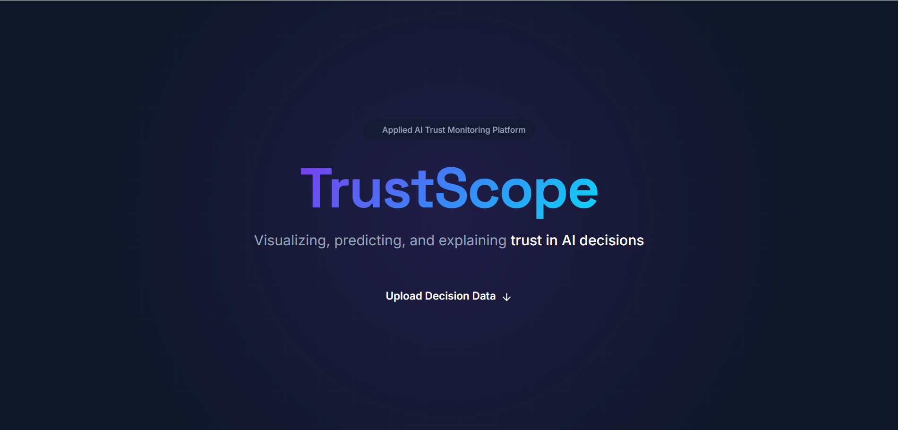
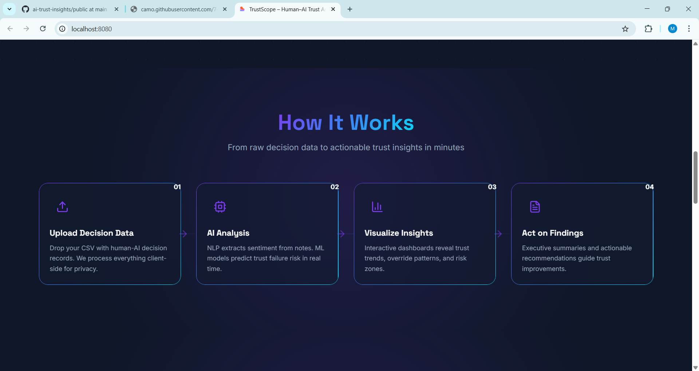
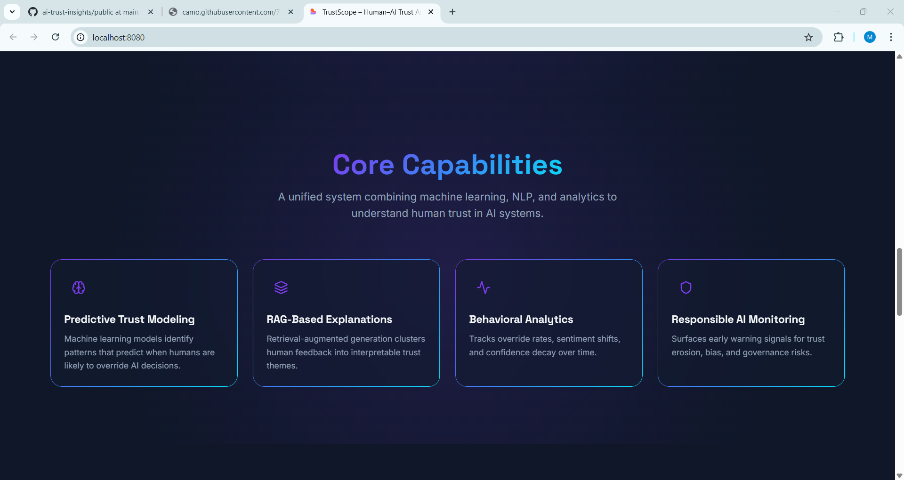
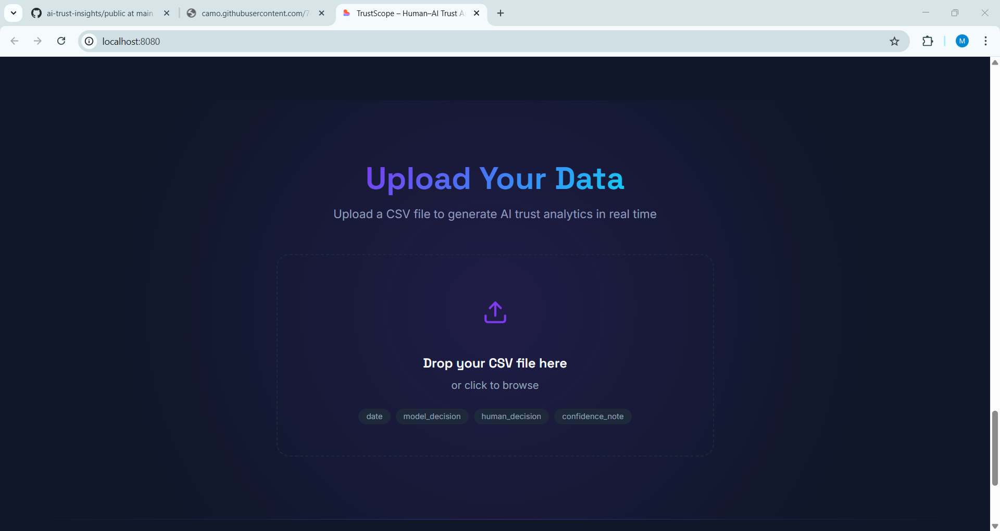
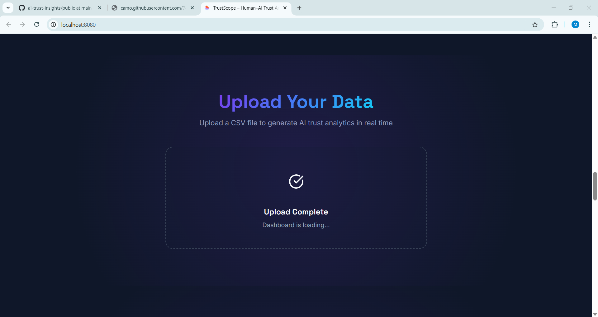
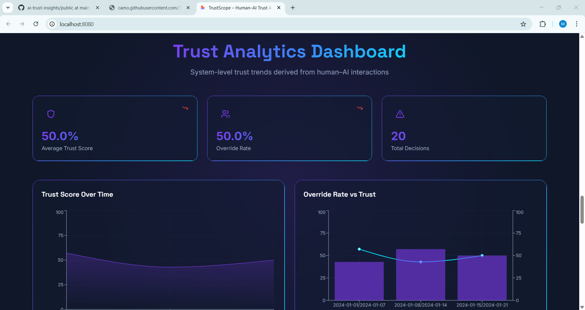
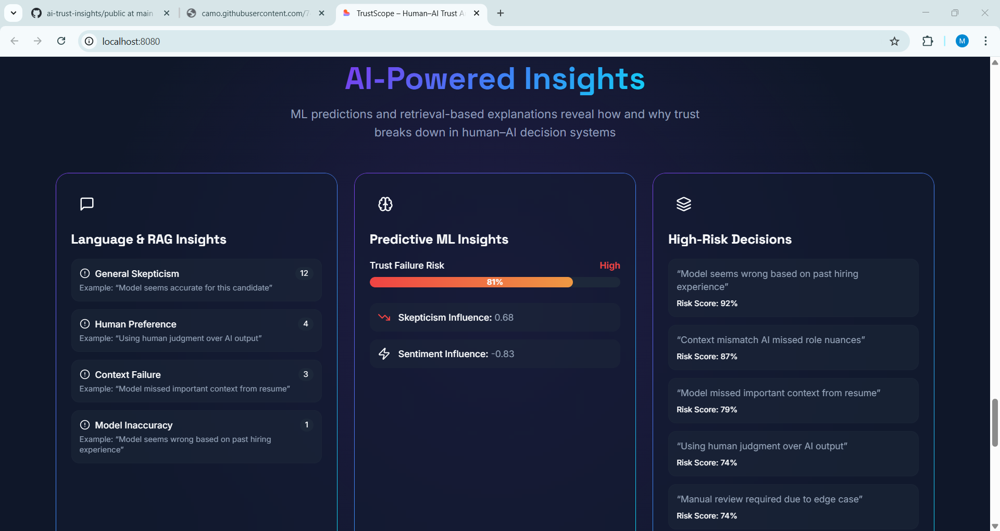
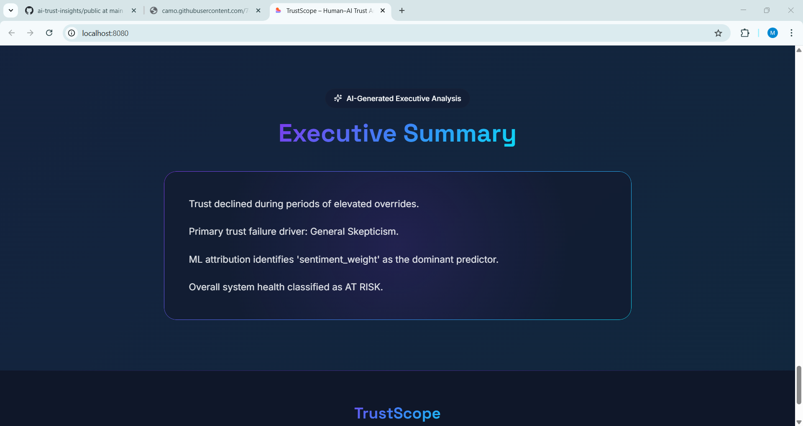

# 🧠 TrustScope – Human–AI Trust Analysis System

> TrustScope is an end-to-end **human–AI trust analysis and monitoring system**
> built using **FastAPI**, **NLP**, and **Machine Learning**.
> 
>
>
>
> It analyzes **human overrides and feedback** to quantify trust,
> monitor trust decay, and explain *why humans stop relying on AI systems*.
>
> Designed for **human-in-the-loop AI**, **AI governance**, and
> **responsible AI deployments**.

## 🔍 Key Features

- 📤 CSV-based human–AI interaction data upload
- 🧠 NLP-driven sentiment analysis (VADER)
- 🧩 Skepticism detection from confidence notes
- 🤖 Machine learning–based override risk prediction
- 📉 Trust score estimation (0–1)
- 📊 Weekly trust analytics
- 🧩 RAG-style clustering of human feedback
- 🧑‍💼 Executive-level trust summary
- ⚠️ System health classification

## 🧠 Trust Analysis Architecture
Human–AI Interaction Logs
↓
Sentiment & Skepticism Extraction
↓
Override Detection
↓
Trust Risk Model
↓
Temporal Trust Metrics
↓
Theme Analysis
↓
Executive Trust Insights

## 🤖 Machine Learning Architecture

### Trust Prediction Model

| Component | Purpose |
|---------|--------|
| Sentiment Score | Captures confidence in AI decisions |
| Skepticism Flag | Detects linguistic mistrust signals |
| Logistic Regression | Predicts probability of human override |
| Feature Weights | Interpretable trust attribution |

## 📁 Input Data Format

| Column Name | Description |
|------------|-------------|
| date | Date of interaction |
| model_decision | AI system output |
| human_decision | Final human decision |
| confidence_note | Human feedback |

Override is inferred when:

`model_decision != human_decision`

## 🚀 API Overview

**POST /analyze**

Input  
- CSV file

Output  
- Trust metrics  
- Override risk predictions  
- Feedback themes  
- Executive summary  

## 🧰 Tech Stack

| Layer | Technology |
|-----|------------|
| Backend | FastAPI |
| ML | scikit-learn |
| NLP | NLTK (VADER) |
| Data | Pandas, NumPy |
| Serving | Uvicorn |
